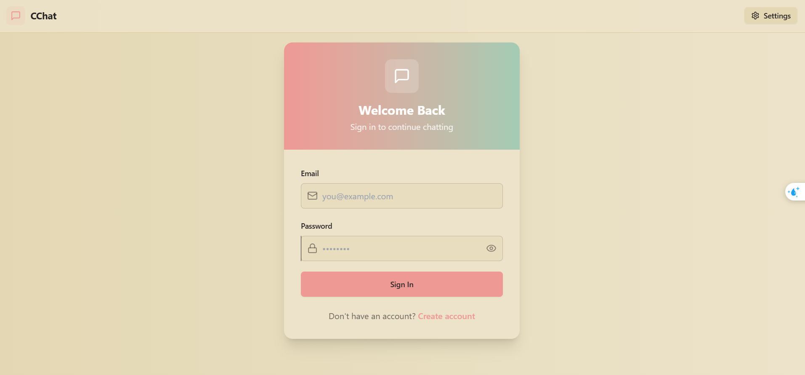
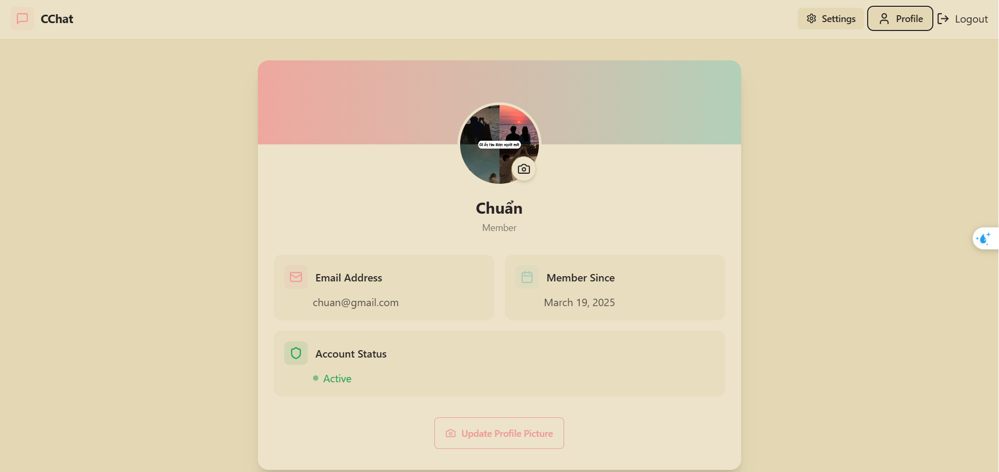

# Real-time Chat Application

A full-stack real-time messaging platform with modern UI, authentication, and real-time features.

## Technology Stack

### Frontend
- React.js with Vite for fast development and optimized builds
- Zustand for state management
- Socket.io client for real-time communication
- Tailwind CSS with DaisyUI for responsive, theme-based UI design
- React Router for client-side navigation
- Axios for API requests

### Backend
- Node.js and Express.js for RESTful API
- MongoDB with Mongoose for database operations
- JWT for secure authentication
- Socket.io for bi-directional real-time communication
- Cloudinary for image storage and optimization
- Bcrypt for secure password hashing

## Key Features Implemented

- User authentication with JWT and HTTP-only cookies
- Real-time message delivery with typing indicators
- Online/offline user status tracking
- User profile customization with image uploads
- Theme customization with persistent preferences
- Message history with read receipts
- Responsive design for all device sizes
- Image sharing in conversations

## Development Approach

- Implemented clean architecture separating business logic, UI, and data layers
- Built reusable components for consistent UI/UX
- Used custom hooks for shared functionality
- Implemented proper error handling and loading states
- Added security best practices like CSRF protection and secure cookies
- Optimized API requests with proper caching

### Setup .env file

### Build the app

```shell
npm run build
```

### Start the app

```shell
npm start
```


